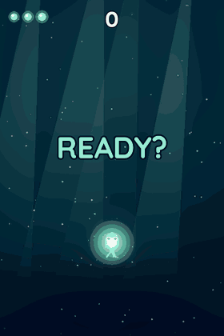
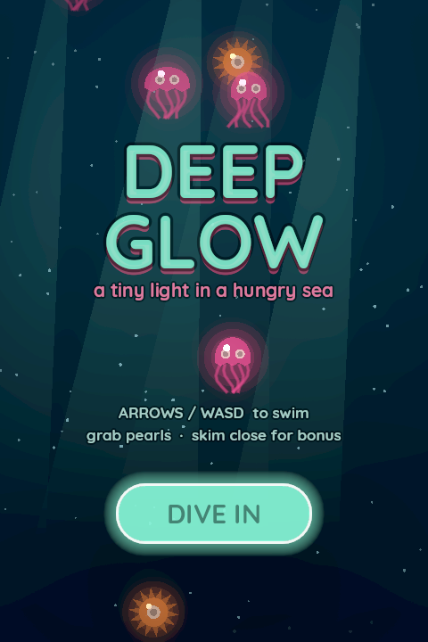
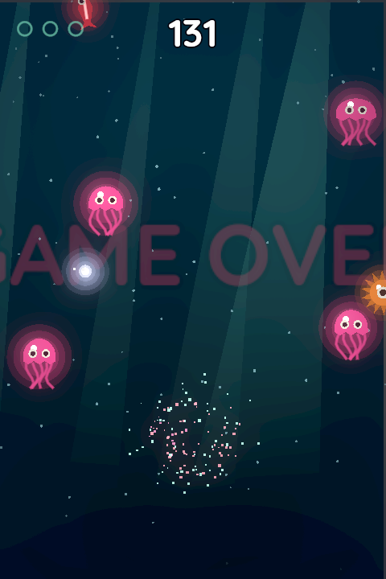
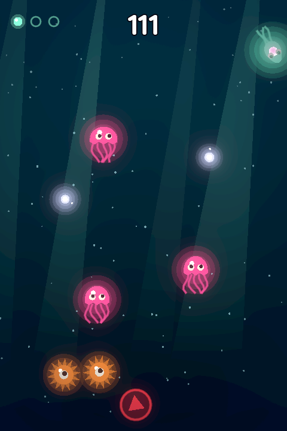
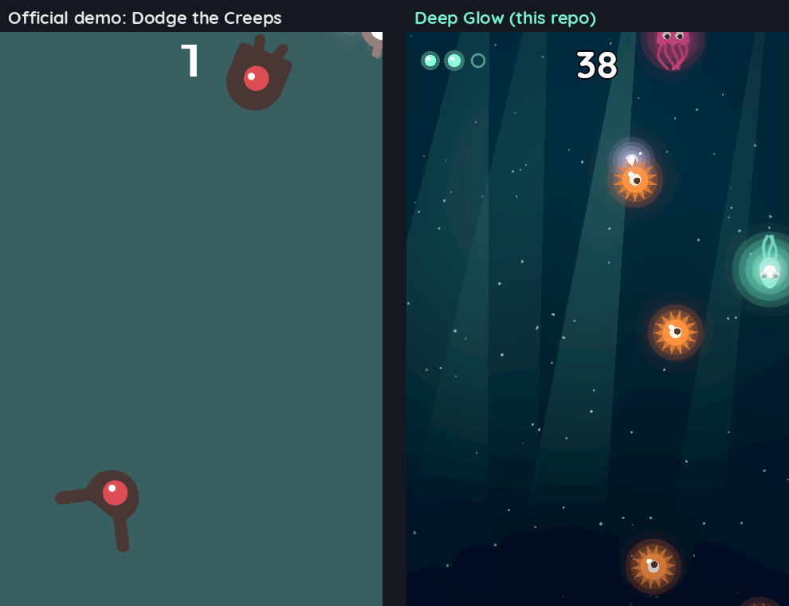

# Deep Glow

A small deep-sea arcade dodger made with **Godot 4.7**. You're a glowing squid in the dark: swim around jellies, urchins and darts, pick up pearls, and skim close for bonus points.

<p align="center"></p>

| Title | Gameplay | Near miss |
|---|---|---|
|  |  |  |

## Play

1. Install [Godot 4.7](https://godotengine.org/download).
2. `godot --path .` (or open `project.godot` in the editor and press F5).

| Key | Action |
|---|---|
| Arrows / WASD | Swim |
| Enter / Space / click **DIVE IN** | Start |

**Scoring:** +1 per tick you survive, +50 per pearl, +20 for a near miss (paid once the creature has passed without touching you). You have 3 lives, with a short blink of invulnerability after each hit.

## What's in it

- **Player:** a vector squid that turns to face its motion, eases in and out of speed, wiggles its tentacles and leaves a light trail and bubbles.
- **Three enemy types:** a pulsing jelly, a spinning urchin, and a fast dart that shows a warning at the screen edge before it comes in. Their eyes follow you.
- **Game feel:** a brief freeze on each hit, screen shake, a flash, particle bursts, floating score text and a slow-motion moment on death.
- **Look:** light shafts, drifting specks with a slight parallax, a seabed outline, a vignette shader and 2D glow (HDR 2D).
- **No external assets.** All art is drawn in code. Music and sound effects are synthesized by `tools/make_audio.py` (Python stdlib only). The font is Quicksand (OFL, licence in `fonts/`).

## Measured against the official demo

This game was built in a *gauntlet loop*: a builder agent works on the game, and a separate critic compares real gameplay frames against Godot's official [Dodge the Creeps](https://github.com/godotengine/godot-demo-projects/tree/master/2d/dodge_the_creeps) demo without being told which game is which. Both games are driven by the same scripted input, and frames are recorded with Godot's Movie Maker mode. See `PROGRESS.md` for the round log.



Reproduce the frames (needs a display, since Movie Maker renders for real):

```bash
tools/capture.sh . /tmp/frames 450              # this game
tools/capture.sh path/to/dodge_the_creeps /tmp/ref 450   # the reference
```

Headless smoke test (should print nothing):

```bash
godot --headless --path . --quit-after 300 2>&1 | grep -E 'ERROR|WARNING|SCRIPT' | grep -vE 'leaked at exit|still in use at exit'
```

## Built with

- [Claude Code](https://claude.com/claude-code) using the [godot-ai](https://github.com/hi-godot/godot-ai) MCP, which drives the live editor (scenes, nodes, scripts, themes and resources were created through it). The plugin is included in `addons/godot_ai/` under its MIT licence. It also registers a runtime autoload (`_mcp_game_helper`) that the MCP uses to screenshot the running game.
- [godot-mcp](https://github.com/Coding-Solo/godot-mcp) for headless runs and debug output.

## Layout

```
main.tscn / main.gd        game flow, spawning, scoring, juice
player.*  enemy.*  pearl.* actors (drawn in code)
hud.*  theme.tres          UI, title, game over
background.gd              gradient, light shafts, drifting specks, seabed
vignette.gdshader          screen vignette
audio/                     generated wavs (see tools/make_audio.py)
tools/                     audio generator + capture rig
```
